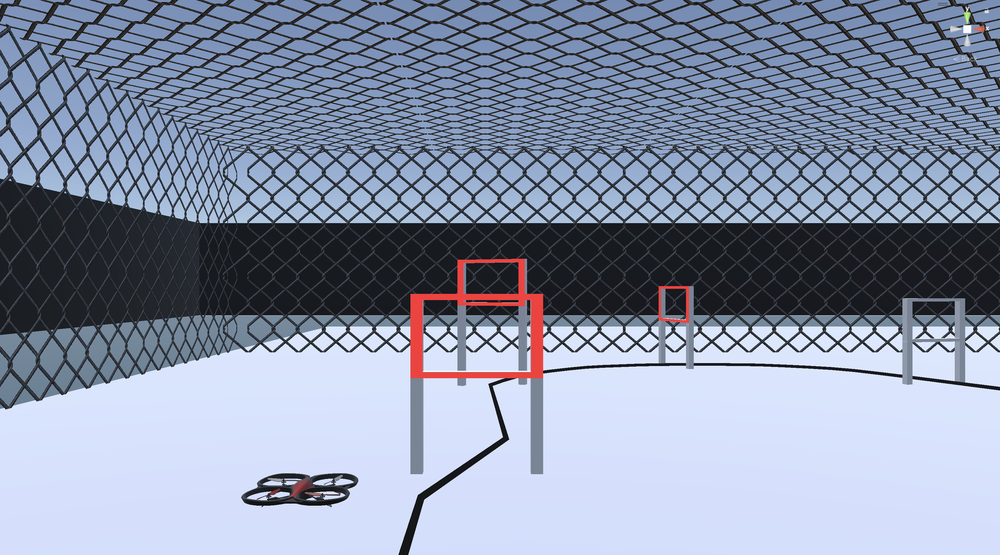
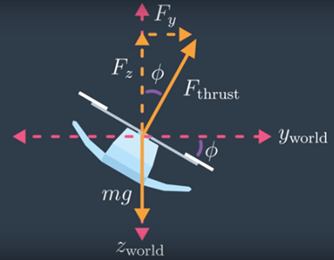
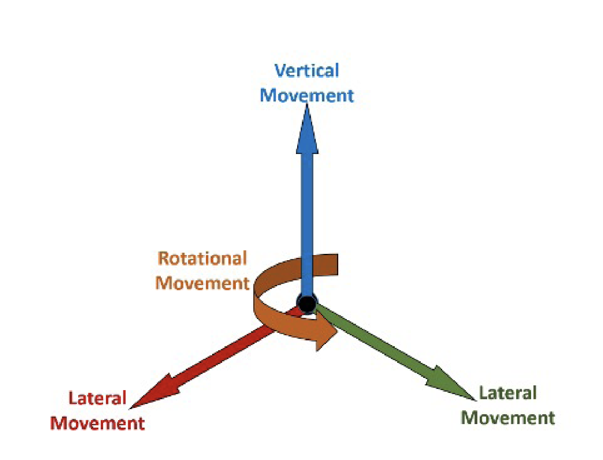
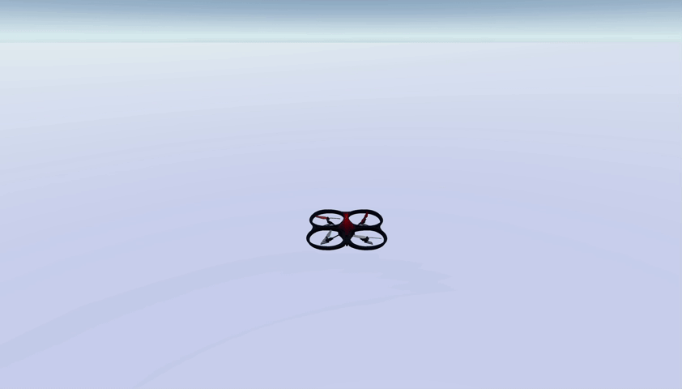

# Quadrotor Simulation in Unity

**quadrotor-simulation-unity** is a Unity-based quadrotor simulation designed for reinforcement learning and AI-based navigation.



---
## Table of Contents

- [Quadrotor Simulation in Unity](#quadrotor-simulation-in-unity)
  - [Table of Contents](#table-of-contents)
  - [Overview](#overview)
  - [Features](#features)
  - [Physics Simulation](#physics-simulation)
    - [1. Thrust, Lift Calculation \& Rigidbody Force](#1-thrust-lift-calculation--rigidbody-force)
    - [2. Pitch, Roll, \& Yaw Control](#2-pitch-roll--yaw-control)
  - [Customizable Parameters](#customizable-parameters)
  - [Controls](#controls)
  - [Actions](#actions)
  - [Installation](#installation)
    - [1. Install Unity and Clone the Project](#1-install-unity-and-clone-the-project)
    - [2. Install Dependencies](#2-install-dependencies)
  - [Usage (Training \& Testing)](#usage-training--testing)
  - [Using the Simulation in Python](#using-the-simulation-in-python)
    - [Step 1: Build the Unity Simulation](#step-1-build-the-unity-simulation)
    - [Step 2: Set Up Your Python Environment](#step-2-set-up-your-python-environment)
      - [1. Create a Conda Environment](#1-create-a-conda-environment)
      - [2. Install Required Packages](#2-install-required-packages)
    - [Step 3: Run the Simulation in Python](#step-3-run-the-simulation-in-python)
  - [Contributing](#contributing)
    - [Steps to Contribute:](#steps-to-contribute)
  - [License](#license)

## Overview
**Quadrotor Simulation in Unity** is a high-fidelity quadrotor simulation designed for:
- **AI Training**: Train reinforcement learning models to control drones 
- **Computer Vision**: Develop and test vision-based navigation systems
- **Autonomous Racing**: Develop AI for drone racing competitions  
- **Robot Learning**: Experiment with flight physics and control models 

## Features
✔ **Quadrotor Flight Simulation**:  
&nbsp;&nbsp;&nbsp;&nbsp;Simulates realistic aerodynamics and drone motion  

✔ **Physics-Based Flight Controls**:  
&nbsp;&nbsp;&nbsp;&nbsp; Customizable Flight Controls & Physics Parameters

✔ **ML-Agents Integration**:  
&nbsp;&nbsp;&nbsp;&nbsp;Train AI models and integrate with python using Unity ML-Agents Toolkit  

---

## Physics Simulation

The drone's movement is simulated using **rigidbody physics** in Unity. The key aspects of the physics model include:

### 1. Thrust, Lift Calculation & Rigidbody Force
- The drone applies an upward force (`engineForce`) to counteract gravity.

- The drone applies forces using rb.AddForce(), ensuring realistic acceleration and deceleration.

- Initial drag and angular drag are stored and can be adjusted for stability.



---

### 2. Pitch, Roll, & Yaw Control
- The agent receives **continuous action inputs** to control:
  - **Pitch (Forward/Backward Tilt)**
  - **Roll (Side-to-Side Tilt)**
  - **Yaw (Rotation Around Vertical Axis)**
  - **Throttle (Up/Down Movement)**

- Movements are **smoothly interpolated** using:
  
  ```csharp
  finalPitch = Mathf.Lerp(finalPitch, pitch, Time.deltaTime * lerpSpeed);
  finalRoll = Mathf.Lerp(finalRoll, roll, Time.deltaTime * lerpSpeed);
  finalYaw = Mathf.Lerp(finalYaw, yaw, Time.deltaTime * lerpSpeed);
  ```

  

---

## Customizable Parameters
| Parameter | Description | Default |
|-----------|------------|---------|
| `maxPower` | Maximum engine thrust power | `100f` |
| `minMaxPitch` | Max forward/back tilt (pitch) | `20f` |
| `minMaxRoll` | Max side tilt (roll) | `20f` |
| `YawPower` | Rotation speed around vertical axis | `5f` |
| `horizontalSpeedFactor` | Speed multiplier for movement | `2f` |
| `lerpSpeed` | Smooth control response | `2f` |
| `weightLbs` | Drone weight (lbs) | `1f` |

You can modify these parameters in the Agent's behavior configuration to customize flight dynamics.

---

## Controls
| Action    | Key Bindings         |
|-----------|----------------------|
| **Pitch** | `W` (forward) / `S` (backward) |
| **Roll**  | `A` (left) / `D` (right) |
| **Yaw**   | `Q` (left) / `E` (right) |
| **Throttle** | `Space` (up) / `Left Shift` (down) |


## Actions



---
## Installation
### 1. Install Unity and Clone the Project
1. **Install Unity and Unity Hub** (Recommended version: `Unity 2022.3.12f1 LTS`).
2. **Clone the repository**:
   ```bash
   git clone https://github.com/Oneiben/quadrotor-simulation-unity.git
   cd quadrotor-simulation-unity
   ```
3. **Open in Unity**: Launch **Unity Hub**, select `Open Project`, and choose the cloned folder.

### 2. Install Dependencies
- Open **Package Manager** and add:
  - `ml-agents`
  - `Input System`

---

## Usage (Training & Testing)
For reinforcement learning training or testing AI models:  
🔗 [RL Quadrotor Navigation Repository](https://github.com/Oneiben/drone-rl-navigation.git) - A complementary repository for training RL-based drone navigation.

---

## Using the Simulation in Python

This project supports **Python integration** for AI-based control using **ML-Agents**.

### Step 1: Build the Unity Simulation
Before running the simulation in Python, **build the Unity environment**:
1. In **Unity**, go to `File` → `Build Settings`.
2. Select **Windows/Linux/Mac** based on your OS.
3. Click **Build**, and save the executable.

### Step 2: Set Up Your Python Environment  

#### 1. Create a Conda Environment  
First, create a **conda environment** with Python **3.10.12**:  

```sh
conda create -n quad-sim python=3.10.12 -y
conda activate quad-sim
```

#### 2. Install Required Packages  
Now, install the necessary dependencies:  

```sh
pip install mlagents_envs==1.0.0
```

**Tip:** Make sure you have the latest version of `pip` before installing packages:  

```sh
pip install --upgrade pip  
```

### Step 3: Run the Simulation in Python

```python
from mlagents_envs.environment import UnityEnvironment
from mlagents_envs.envs.unity_gym_env import UnityToGymWrapper

class UnityEnvironmentWrapper:
    def __init__(self, env_path):
        """
        Initialize the Unity environment wrapper with the given path.
        
        Args:
            env_path (str): Path to the Unity environment application.
        """
        self.unity_env = UnityEnvironment(env_path, no_graphics_monitor=False, no_graphics=False)
        self.env = UnityToGymWrapper(self.unity_env, uint8_visual=True, allow_multiple_obs=True)

    def reset(self):
        """
        Reset the Unity environment and return the initial observation.
        
        Returns:
            tuple: Initial observation from the environment.
        """
        return self.env.reset()

    def step(self, action):
        """
        Step the environment forward with the given action.
        
        Args:
            action (list): Action to take in the environment.
        
        Returns:
            tuple: Updated observation, reward, done flag, and additional info.
        """
        return self.env.step(action)

    def close(self):
        """
        Close the Unity environment when done.
        """
        self.env.close()

# Example Usage
if __name__ == "__main__":
    env_path = "path/to/quad_sim"  # Update with the actual build path
    env = UnityEnvironmentWrapper(env_path)
    
    obs = env.reset()
    done = False
    while not done:
        action = [0, 0, 0, 0]  # Replace with actual control inputs
        obs, reward, done, info = env.step(action)

    env.close()
```
---

## Contributing

Contributions are welcome! If you have suggestions or improvements, feel free to fork the repository and create a pull request.

### Steps to Contribute:

1. Fork the repository.
2. Create a new branch:
   ```bash
   git checkout -b feature-name
   ```
3. Commit your changes:
   ```bash
   git commit -m "Description of changes"
   ```
4. Push the changes and open a pull request.

---

## License
This project is licensed under the MIT License. See the [📜 LICENSE](LICENSE) file for more details.
